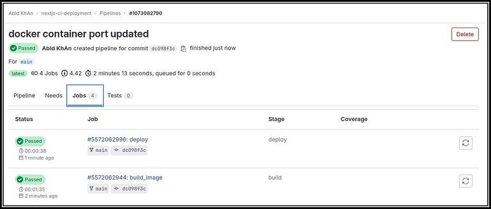

## NextJS app deployment using Gitlab CI

Streamline the deployment of your Next.js application effortlessly with GitLab CI automation. Enhance efficiency and reduce deployment hassles with a seamless integration approach. Let’s dive in.

**TL;DR**

**Issue:** In the NextJS deployment on production, downtime occurs due to server building. Pulling the updated code from the Git repository and running `next build` on the production server leads to the unavailability of the application.

**Resolution:** To mitigate this issue, a proposed solution involves building the application in a separate environment and storing the successful build in a Docker registry. Subsequently, the updated image can be pulled from the Docker registry onto the production server for deployment, reducing downtime during the build process.

**Prerequisites**

1. Gitlab account
2. NextJS application
3. Remote Server (In this case, it’s Azure VM)
4. Docker Registry account (DockerHub)

**Playground**

In the variable segment, local additions include `IMAGE_NAME` and `IMAGE_TAG`, while `REGISTRY_USER`, `REGISTRY_PASS`, and `SSH_KEY` (for the server) are securely stored in the repository’s CI/CD variables. To make it simple, `IMAGE_TAG` is being hardcoded.

```yaml
variables:
  IMAGE_NAME: abidkhan484/nextjs-ci
  IMAGE_TAG: web-1.0
```

Simplifying the pipeline, the current implementation focuses solely on the build_image and deploy jobs. For image building, the Docker image is employed. In the build section, docker login is included in the before-script segment as a private registry is utilized for image storage. The script section encompasses build and push commands.

```yaml
build_image:
  stage: build
  image: docker:24.0.7
  services:
    - docker:24.0.7-dind
  variables:
    DOCKER_TLS_CERTDIR: "/certs"
  before_script:
    - docker login -u $REGISTRY_USER -p $REGISTRY_PASS
  script:
    - docker build -t $IMAGE_NAME:$IMAGE_TAG .
    - docker push $IMAGE_NAME:$IMAGE_TAG
```

For deploying the image to the server, the before script section grants proper permissions to execute the SSH_KEY. In the script section, SSH login is performed using the SSH_KEY with no host key checking. Subsequently, docker login is executed, considering it’s a private registry. Containers are then deleted to deploy the updated one (specific to a port if needed). Finally, the docker run command is executed to run in the container.

```yaml
deploy:
  stage: deploy
  before_script:
    - chmod 400 $SSH_KEY
  script:
    - ssh -o StrictHostKeyChecking=no -i $SSH_KEY polymath@20.115.117.121 "
        docker login -u $REGISTRY_USER -p $REGISTRY_PASS &&
        docker ps -aq | xargs docker stop | xargs docker rm &&
        docker run -d -p 5000:3000 $IMAGE_NAME:$IMAGE_TAG"
```
Referencing the pipeline jobs, the provided example showcases the final output.



The conclusive code is provided below for your reference.

[.gitlab-ci.yml](https://gitlab.com/abidkhan484/nextjs-ci-deployment/-/blob/main/.gitlab-ci.yml)
